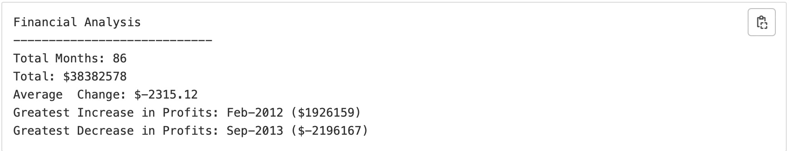
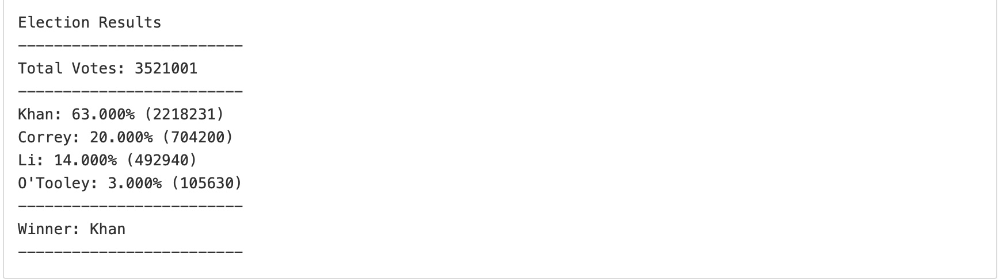
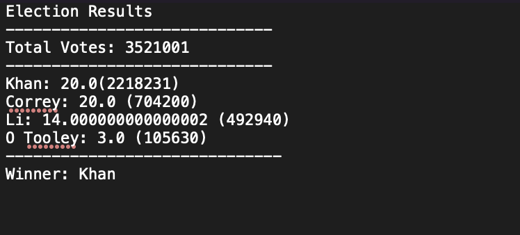
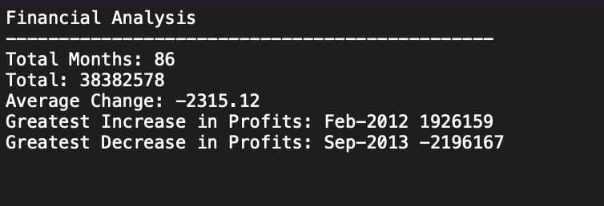
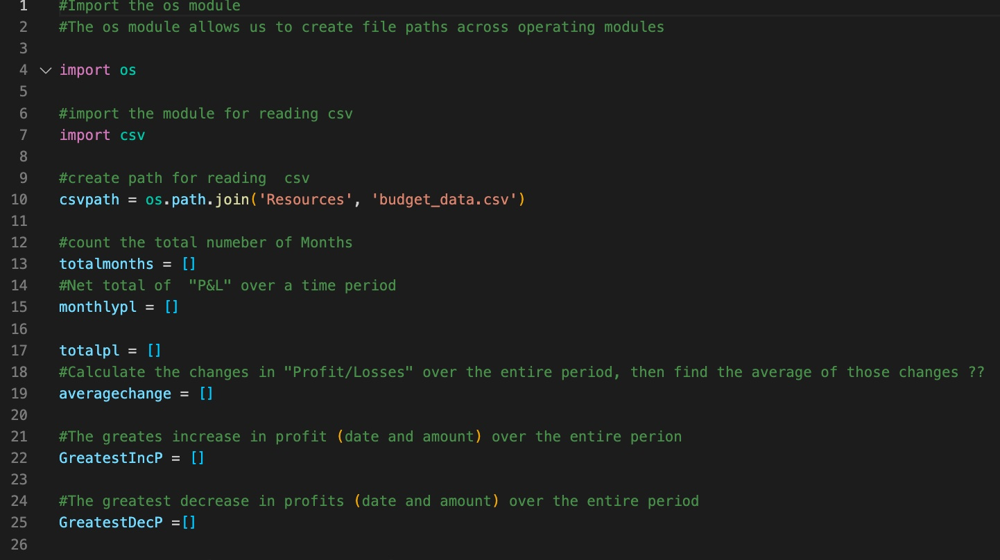
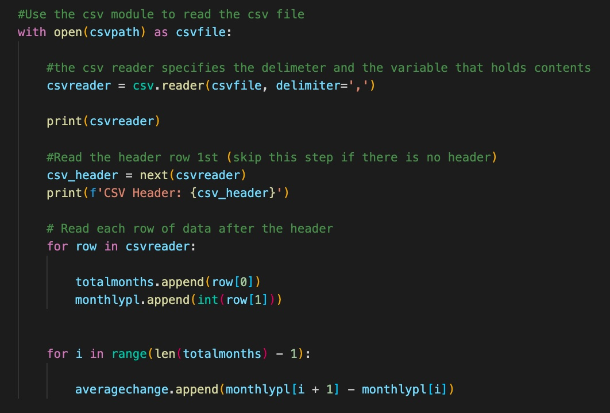
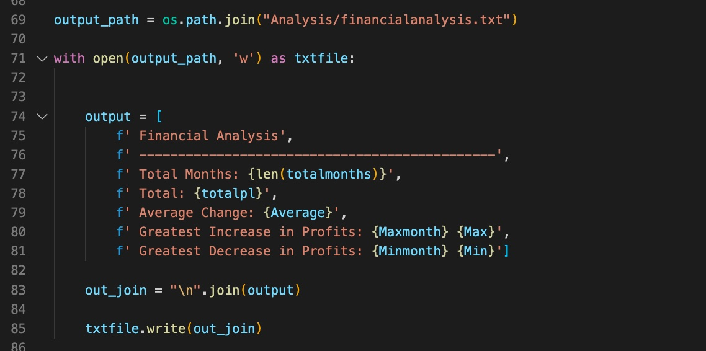

# Numbers With Python
Reading csv's, writing .txt files and For loops


## Table of Contents
* [General Info](#general-info)
* [Technologies Info](#technologies)
* [Setup](#Setup)
* [Features](#features)

## General Info
Numbers With Python is a real world application Python. Numbers with Python solve real world problems using tools in the python programming languauge. Importing modules like csv, storing content in variables, list and dictionary to iterate through big data scructures and debugging are skills used to accomplish this task.

### PyBank

Create a script analyzing financial records of a company using finiacial data. 


Calculate total number of months in the dataset. Net total amount of "Profit/Losses" over the period. Calculate the changes in "Profit/Losses over the period. Average "Profit and Loss" change every month. Find the greatest increase in profit (date and amount), find the greatest decrease in profits (date and amount) over the entire period.



### Pypoll

Create a python script to modernize the vote counting process of a rural town.


Total the number of votes. Complete list of candidates who received votes. 
Calculate the percentage of votes each candidate won. Calculate the total number of votes each candidate won. Find the winner of the election based on popular vote. 



## Technologies
* Python
* For loops
* Reading Csv files
* Writing txt files
* Creating variables
* Appending data


## Set up
To run this project install it locally:
Navigate into directory
```
$ cd /Numbers-With-Python/Pybank/PyBank
$ python main.py
$ cd /Numbers-With-Python/Pypoll
$ python main.py
```


## Features
Election Analysis


Financial Analysis


Importing modules and creating variables to store data.


Reading csv using a for loop and appending data.


Writing a text file.

